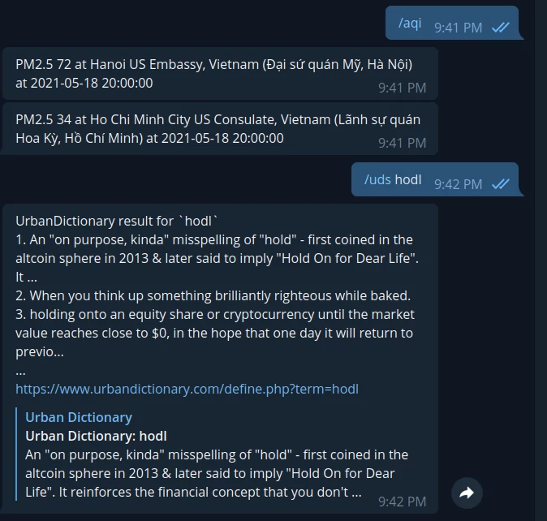

# UDSBot

A Telegram bot implemented from scratch for learning purpose.

## Who should use this
It is okay to use for personal usage, if you don't need the bot to response instantly.

Normal users should use bot frameworks such as Errbot, ...

## Usage

Get bot token: https://core.telegram.org/bots#6-botfather
Set `BOT_TOKEN` env then run bot.py.

To get weather and temperature data, get free api in https://openweathermap.org/api
then set `WEATHER_TOKEN` env and run bot.py.